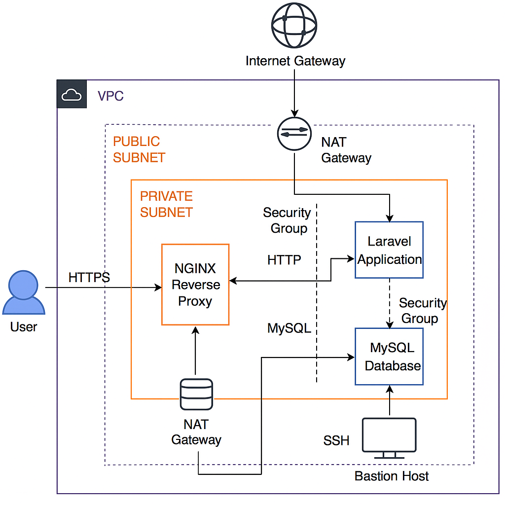

<!-- @format -->

# 🛠️ Laravel + MySQL Private Deployment on AWS with Terraform + Ansible

Proyek ini adalah infrastruktur otomatis menggunakan **Terraform** dan **Ansible** untuk membangun arsitektur dengan 2 subnet:

- **Public subnet**:

  - Bastion host (SSH access)
  - Nginx reverse proxy untuk Laravel dan phpMyAdmin

- **Private subnet**:
  - Laravel server (tanpa public IP)
  - MySQL server (hanya dapat diakses oleh Laravel & Bastion)
    - autobackup to s3 amazon

# Infrastructure Setup

This project sets up a 2-subnet VPC infrastructure with Laravel and MySQL.

## Diagram



## Components

- Laravel Private Server
- MySQL Private Server
- Bastion Host
- Nginx Reverse Proxy

## 🔧 Teknologi Digunakan

- Terraform (untuk provisioning VPC, subnet, security group, EC2, EIP)
- Ansible (untuk konfigurasi aplikasi Laravel, MySQL, phpMyAdmin)
- AWS EC2, VPC, NAT Gateway, EIP

## 📌 Alur Infrastruktur

1. **User** → mengakses domain `{domain}` (HTTPS) → masuk ke Nginx Reverse Proxy (public)
2. **Nginx Reverse Proxy** → meneruskan request ke private subnet (Laravel / phpMyAdmin)
3. **Bastion** → digunakan untuk SSH ke dalam instance Laravel dan MySQL secara privat
4. **Laravel App** → terhubung ke database MySQL di subnet private

## 🚀 Langkah Setup

### 1. Provision dengan Terraform

```bash
cd terraform/
terraform init
terraform plan
terraform apply
```

Output penting:

Public IP Bastion

Public IP Nginx

Private IP Laravel & MySQL


2. Konfigurasi dengan Ansible
   cd ../ansible/
   ansible-playbook -i inventories/production/all_host.ini playbook/site.yaml
   \*\*Pastikan SSH sudah siap dari local ke Bastion dan public key sudah didistribusi.

🔐 Security
Semua server private tidak memiliki public IP

MySQL hanya dapat diakses oleh Laravel private dan Bastion

Laravel hanya bisa diakses oleh Nginx reverse proxy

Bastion hanya bisa diakses dari IP developer tertentu (hardcoded)

📂 Direktori Penting
terraform/: Provisioning resource AWS

ansible/: Role-based deployment (Laravel, MySQL, phpMyAdmin)

inventories/: Struktur host untuk Ansible (termasuk ProxyJump)

✍️ Kontribusi
Silakan forking atau membuat PR untuk perbaikan dan saran!


